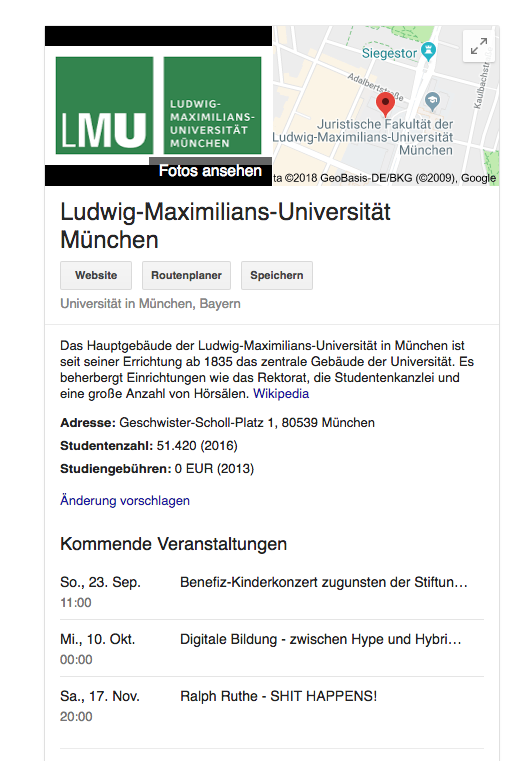

Entwicklung und Design 
=======================

## Aufgabenbereich und Zielgruppe

Dieser Anwendungsbereich betrifft die Entwicklung und das Webdesign von Webangeboten, Webauftritten und Apps. Teil der Entwicklung ist auch die Umsetzung und Bereitstellung von Templates und Musterseiten, die von Autoren verwendet werden. Auch automatisch erstellte Ausgaben werden durch diese Zielgruppe definiert.

Dieses Kapitel wendet sich an folgende Personenkreise:

-   Webdesigner
-   Webentwickler

## Grundlagen

Die Entwicklung von Webangeboten, Webauftritten und Apps ist abhängig von der jeweiligen Arbeitsweise der Beteiligten, von definierten Workflows und Prozessen und von vorgegebenen Frameworks.
Der Leitfaden kann keine Empfehlungen zur Arbeitsorganisation und zum idealen Ablauf eines Webprojektes geben. Dies würde den Rahmen des Leitfadens deutlich sprengen. Daher werden hier nur die wichtigsten Problemfelder bei der Entwicklung und Bereitstellung von Webangeboten, Webauftritten und Apps angesprochen und für eine tiefergehende Beschäftigung auf relevante Webseiten verwiesen.

Ein umfangreiches Tutorial für die Entwicklung und Gestaltung von Webangeboten und Webauftritten bietet das  [Web Accessibility Tutorial des W3C](https://www.w3.org/WAI/tutorials/). Dieses sollte sowohl bei Neuentwicklungen als auch bei der Korrektur vorhandener Webangebote als Grundlage und Nachschlagewerk genommen werden. Das Tutorial erläutert, wie Teile von Webangeboten erstellt werden können, um sowohl die Konformität zu den WCAG sicherzustellen, als auch die Benutzererfahrung für alle Nutzer einer Seite zu erhöhen.
Es gliedert sich in folgende Teile: 

* [Strukturierung und Layout](https://www.w3.org/WAI/tutorials/page-structure/)
* [Menüs und Navigationskonzepte](https://www.w3.org/WAI/tutorials/menus/)
* [Bilder](https://www.w3.org/WAI/tutorials/images/)
* [Tabellen](https://www.w3.org/WAI/tutorials/tables/)
* [Formulare](https://www.w3.org/WAI/tutorials/forms/)
* [Carousels](https://www.w3.org/WAI/tutorials/carousels/)

Weiterhin wurden für Designer und Entwickler die folgenden Empfehlungen und Hinweise zusammengefasst:

* [Tipps und Hinweise zum barrierefreien Webdesign](https://www.w3.org/WAI/tips/designing/)
* [Tipps und Hinweise zur Entwicklung von barrierefreien Markup](https://www.w3.org/WAI/design-develop/)  


Eine weitere hilfreiche Quelle ist die [Standards-Seite des W3C](https://www.w3.org/standards/): Die Plattform enthält ein umfangreiches Nachschlagewerk zur Entwicklung von  Webangeboten, Webauftritten, Apps, aber auch von Schnittstellen, strukturierten Daten und Kommunikationsprotokollen.


## Umsetzung

Die wesentlichen Grundlagen und Beispiele zur Umsetzung werden in den oben genannten Tutorials behandelt. Hier folgen daher lediglich Umsetzungshilfen, die obige Tutorials ergänzen oder Sonderfälle betreffen. 


### Strukturierte Daten 


**Hinweis: Die Umsetzung von strukturierten Daten ist derzeit für die Umsetzung der Barrierefreiheit nicht erforderlich.** 
Gleichwohl kommt es zu positiven Auswirkungen in der Form, dass die Webseite durch Software besser analysiert werden kann. Dies führt unter anderem zu einer besseren Auffindbarkeit mit Hilfe von Suchmaschinen und somit wiederum dazu, dass Menschen die Inhalte besser finden, bevor sie die Seite überhaupt besuchen.

Strukturierte Daten erlauben es, die Semantik von HTML mit Hilfe standardisierter Anweisungen zu erweitern. HTML erlaubt zwar die Auszeichnung von Überschriften, Absätzen und Bildern, definiert jedoch keine Aussagen über den Inhalt. 
Menschen können anhand von Kontext und Inhalt erkennen, worum es geht. Diese Möglichkeit hat Software (abseits von Machine Learning) jedoch nicht. 
Die in der [WAI-ARIA 1.1](https://www.w3.org/TR/wai-aria/) durch die W3C definierte Spezifikation kann dieses Problem auch nicht lösen. Die ARIA erlaubt zwar die Auszeichnung von Strukturen, Bedienelementen und Inhaltstypen einer Webseite, sie macht aber keine Aussagen zur inhaltlichen Bedeutung.


Das Schema aus der Beschreibung des W3C zur [Spezifikation RDFa 1.1](https://www.w3.org/TR/rdfa-primer/) beschreibt das Problem: Auf der linken Seite ist das zu sehen, was die Browsersoftware sieht: Zwei Überschriften, einen mit `<em>` markierten Text und darunter ein Absatz. Gefolgt von eine Linkliste.

Ein Mensch hingegen interpretiert es als einen Artikel mit einer Hauptüberschrift, einer kleineren Überschrift zur Angabe des Autors, einer Datumsangabe und darauf folgend den eigentlichen Artikel, gefolgt von einer Tagclound und einem Link zu Copyright-Informationen.

Suchmaschinen und spezialisierte Softwareprodukte werten strukturierte Daten auf Webseiten aus und liefern diese dann in geeigneter Weise an Menschen aus. 

So zum Beispiel:

- durch die Anreicherung der Ergebnisliste einer Suche mit Öffnungszeiten, Terminen, lokaler Suche, hervorgehobenen Links;
- durch Auslesen von aktuellen Terminen aus Webseiten und Weiterverwendung dieser in anderen Anwendungen;
- durch die automatische Erkennung von Telefonnummern auf Webseiten und Verknüpfung dieser mit der Anruffunktion auf mobilen Devices.

Bei der Suche in Google wird beispielsweise bei der Suche nach der Universität Erlangen unterhalb eines Treffers auch eine Auswahlliste an Öffnungszeiten gezeigt. 

 

Bildnachweis: © Google LLC, Suchmaschine , Suche: Universität Erlangen https://www.google.com/search?q=universit%C3%A4t+erlangen

Und bei der Suche nach der LMU wird für diese im Infopanel eine Liste der kommenden Veranstaltungen angeboten.



Bildnachweis: © Google LLC, Suchmaschine, Suche: LMU München https://www.google.com/search?q=lmu+m%C3%BCnchen

Der Nebeneffekt dieser Anzeigen ist, dass der Benutzer der Suchmaschine ohne Umweg über die Startseite der jeweilige Webseite gleich zu dem jeweiligen Angebot springen kann.

In HTML geschieht die Auszeichnung dieser Inhalte durch die Attribute `itemscope` und `itemprop`. 

##### Beispiel Termin mit strukturierten Daten 

Ohne strukturierte Daten würde eine Terminangabe in HTML so aussehen:

```html
<div class="event">
	  <h2>Webkongress Erlangen</h2>
	  <em>12. September 2018, 9:00 Uhr</em>
	  Department Mathematik 
	  <address>  
			Cauerstraße 11
			91058 Erlangen
	  </address>
</div>
```

Mit Anwendung der [Schema.org-Beschreibung zu Terminen](https://schema.org/Event) wird hieraus folgendes:


```html
<div class="event" itemscope itemtype="http://schema.org/Event">
	  <h2>Webkongress Erlangen</h2>
	  <em itemprop="startDate" content="2018-09-12T09:00">
	      12. September 2018, 9:00 Uhr
	  </em>
	  <div class="event-venue" itemprop="location" 
	        itemscope itemtype="http://schema.org/Place">
		    <span itemprop="name">	Department Mathematik </span>
		    <address itemprop="address" 
		             itemscope itemtype="http://schema.org/PostalAddress">  
			 	<span itemprop="streetAddress">Cauerstraße 11</span>
				<span itemprop="postalCode">91058</span> 
				<span itemprop="addressLocality">Erlangen</span>
		  	</address>
	   </div>
 </div>
```

Dieser HTML-Code kann von einer Software ausgelesen und interpretiert werden. Dabei spielt dann auch die individuelle Schreibweise bei der Datumsangabe keine Rolle mehr, da die standardisierte Form im Attribut `content="2018-09-12T09:00"` angegeben wurde.

Auf der Seite [schema.org](https://schema.org/) findet sich eine Übersicht der gebräuchlichsten Inhaltstypen mit Beispielen für deren Anwendung. Um zu prüfen, ob die Angaben korrekt waren, kann das [Testtool von Google](https://search.google.com/structured-data/testing-tool?hl=de) aber auch die Browsererweiterung [Semantic Inspector](https://chrome.google.com/webstore/detail/semantic-inspector/jobakbebljifplmcapcooffdbdmfdbjh) (siehe unten) verwendet werde.


#### Vertiefung
- Schema.org: [Übersicht über die Typen strukturierter Daten](https://schema.org/docs/schemas.html)
- Google: [Tutorial zu strukturierten Daten](https://developers.google.com/search/docs/guides/)
- lunapark: [Strukturierte Daten: Mehr Aufmerksamkeit in den SERPs](https://www.luna-park.de/blog/29207-strukturierte-daten/)
- t3n: [Rich Snippets](https://t3n.de/news/rich-snippets-anleitung-534054/)

